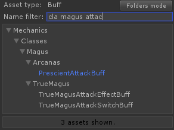
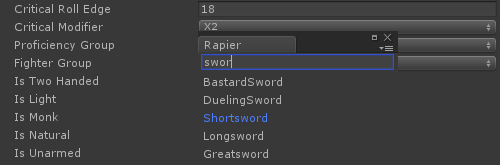
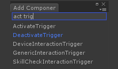
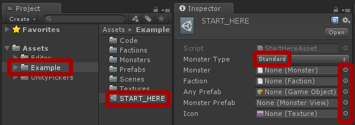

# Unity Pickers

Custom pickers for Unity game engine editor.

### Asset Picker

  

Replacement for default object selection window that shows folders structure and enables filtering by asset path.

### Enum Picker

  

Replacement for default enum selection popup. Allows filtering by value names.

### Type Picker

  

Type selection button for your custom editors.

### Features
* Smart search using multiple strings (space seperated, order matters).
* All pickers provide API to use in your editors.
* User-defined filters (in API).
* Asset Picker is faster than builtin.
* Asset browsing mode.

## Getting Started

### Installing

1. Copy `Assets/UnityPickers` and `Assets/Editor/UnityPickers` to your Unity project.
2. Asset Picker will be instantly enabled for `ScriptableObject` fields in user-defined types.
3. You can mark specific field with `[AssetPicker]` attribute to enable Asset Picker for it.
4. Enum Picker will be instantly enabled for all user-definded enum fields.

### Preview

  

1. Open bundled project in Unity _(I was using 2017.1.1p4)_.
2. Open `START_HERE` asset in inspector and hit object selection buttons near fields to open Asset Picker.
3. Click on enum value of `Monster Type` field to show Enum Picker.
4. STAR_HERE type is defined in `StartHereAsset.cs`. Threre are some field attributes.
5. Select `Tools/Asset Picker` menu or hit `Ctrl+Alt+Shift+O` to open Asset Picker in browsing mode.

## Motivation

Unity Pickers are part of our toolset for [Pathfinder: Kingmaker](https://owlcatgames.com/) production. They are addressing following issues:
* Drag-and-dropping into object fields from Project View becomes less convenient as project grows. Searching for specific object is tiresome.
* Default object selection window doesn't show folder structure and doesn't allow to filter by folder names. It is crucial to make full use of folders structure when you have many files.
* Default object selection window becomes incredibly slow on large projects.
* [ObjectPicker API](https://docs.unity3d.com/ScriptReference/EditorGUIUtility.ShowObjectPicker.html) is clumsy :)
* Default enum selection popup lacks filtering by value names.
* Our component system and visual scripting tools need control for type selection (similar to 'Add Component' for Game Objects).

## Authors
* [**Vasily Boldyrev**](https://github.com/vasyab) - _Owlcat Games_
* [**Alexey Drobyshevsky**](https://github.com/Cotoff) - _Owlcat Games_
* **Alexander Chernyakov** - _Owlcat Games_
* **Alexander Sokolenko** - _Owlcat Games_

## Licence

This code is distributed under the terms and conditions of the MIT license.